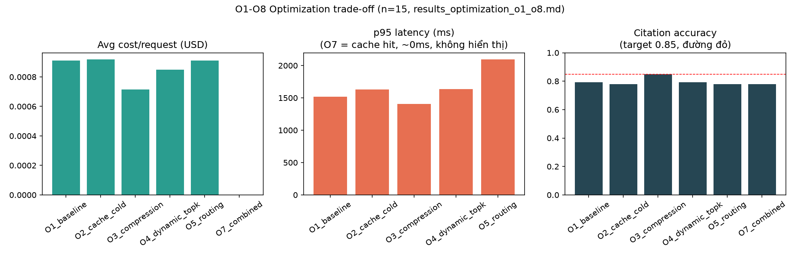

# Final Summary — cấu hình production cuối cùng theo số liệu thật (Phase 12)

Tổng hợp quyết định cuối cùng cho mỗi trục, mỗi dòng đều trỏ về report thật đã đo — không có con số nào ở đây được tính lại/suy diễn, chỉ tổng hợp.

## Cấu hình production theo trục

| Trục | Config cuối cùng | Số liệu quyết định | Nguồn |
|---|---|---|---|
| Chunking | `structure_aware` | recall@5=0.906, nDCG@5=0.787 (thắng fixed/recursive/parent_child) | `results_chunking_ablation.md` |
| Retrieval | `hybrid_dbsf_v2` (DBSF, prefetch=40, rerank tắt) | recall@5=0.932, nDCG@5=0.815 (thắng dense/sparse/RRF; rerank không đáng đổi latency) | `results_retrieval_reranking.md` |
| top_k_after | 5 (thử 10, đã revert) | citation_accuracy 0.700→0.650 khi tăng lên 10 (đo qua generation thật) | CHECKLIST Phase 8 |
| min_score threshold | 1.10 | calibrate từ 875 trace thật, 0 refuse nhầm should_answer | CHECKLIST Phase 8 |
| Prompt | `p7_citation_complete_safe_v1` | refusal_accuracy=0.90, citation_accuracy=0.838, hallucination=0.10 (8 vòng lặp p0→p8, p8 thử-và-loại) | `results_prompt_comparison_p8.md`, `results_prompt_p8_citation_multipart_v1_vs_p7.md` |
| Model (QA thường) | gemini-3.1-flash-lite | ngang chất lượng flash-preview, rẻ hơn 5x, nhanh hơn 10x | `results_model_provider_comparison.md` |
| Model (judge/reasoning) | gemini-3-flash-preview | hallucination 0.0 vs 0.125, faithfulness 1.0 vs 0.9375 — đáng giá cho vai trò cần suy luận kỹ | `results_model_provider_comparison.md` |
| Fallback cuối | qwen2.5:7b (Ollama, local) | reliability net (không downtime), KHÔNG dùng cho chất lượng (kém nhất mọi trục đo được) | `results_model_provider_comparison.md` |
| Quality Gate | `gate_default_v1` | Recall=Precision=1.000 trên 16 kịch bản giả lập, latency không đáng kể | `results_quality_gate_effectiveness.md` |
| Semantic cache | Implement xong, mặc định TẮT | tiết kiệm 100% cost/latency trên câu lặp lại (cơ chế đúng, chưa đo scale thật) | `results_optimization_o1_o8.md` |
| Context compression | Implement xong, mặc định TẮT | citation_accuracy cao nhất trong mẫu n=15 (0.85) nhưng mẫu quá nhỏ để đổi default | `results_optimization_o1_o8.md` |
| Dynamic top-k / routing | Implement xong, mặc định TẮT | không cải thiện rõ rệt ở mẫu n=15 | `results_optimization_o1_o8.md` |

## Biểu đồ trade-off

## 6 thực nghiệm — trạng thái

| # | Tên | Trạng thái | Report |
|---|---|---|---|
| 1 | Chunking Ablation | ✅ | `results_chunking_ablation.md` |
| 2 | Retrieval + Reranking | ✅ | `results_retrieval_reranking.md` |
| 3 | Prompt + Model/Provider | ✅ (model/provider giới hạn bởi không có key OpenAI/Anthropic) | `results_prompt_comparison_p8.md` + `results_model_provider_comparison.md` |
| 4 | Quality Gate Effectiveness | ✅ | `results_quality_gate_effectiveness.md` |
| 5 | Observability + Error Classification | ✅ (kèm phát hiện giới hạn thật của classifier) | `results_error_classification.md` |
| 6 | Cost/Latency/Quality + Feedback | ✅ | `results_optimization_o1_o8.md` |

## Xem thêm

- Tổng hợp lỗi xuyên suốt các experiment: `results_error_analysis.md`.
- Trả lời RQ1-RQ5: `results_research_questions.md`.
- Toàn bộ checklist 12 phase: `docs/system/CHECKLIST_IMPLEMENTATION.md`.
